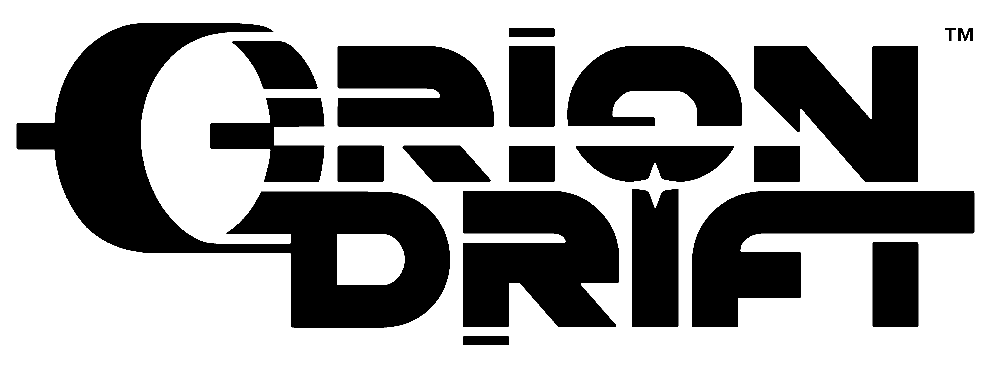
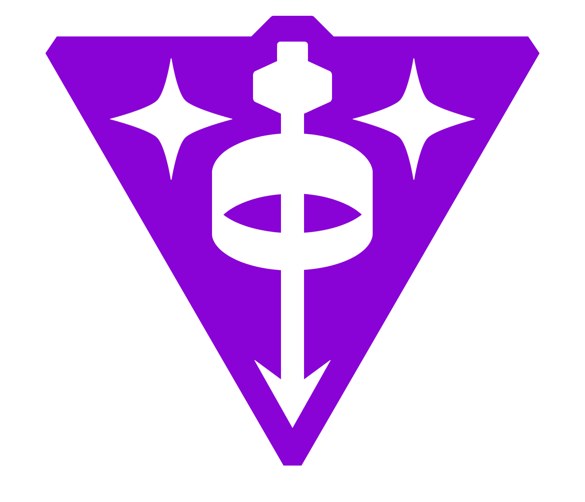

<p align="center">
  
</p>

<h1 align="center">FleetView</h1>

<p align="center">
  
</p>

A production-grade desktop control application for **Orion Drift** fleets and stations,
built around a **data-driven API endpoint registry** so newly discovered endpoints slot in
with near-zero code changes.

> **Status:** Foundation + core modules. See [Honest scope](#honest-scope) below.

## Download & install (for admins)

Grab the latest Windows installer from
[**Releases**](https://github.com/FairyVR/fleetview/releases) → `FleetView Setup x.y.z.exe`.

1. Run the installer. It's **unsigned**, so SmartScreen will warn — click
   **More info → Run anyway**.
2. Launch FleetView and add your Orion Drift API key under **Keys** (owner name is required).
   Keys are stored encrypted on your machine and never leave it.

The repo is private, so you need collaborator access to see Releases.

## The API

| | |
| --- | --- |
| **Base URL** | `https://api.oriondrift.net` |
| **Auth** | `x-api-key: <key>` (**not** `Authorization: Bearer`) |
| **Key format** | a JWT — three dot-separated segments |

These were recovered from the official dashboard's own public client bundles and confirmed
with live probes — see [`docs/API-DISCOVERY.md`](docs/API-DISCOVERY.md) for the full method,
the complete permission-scope list, and the structural gotchas.

## Why a registry, not hardcoded URLs

Every endpoint lives as **data** in
[`src/shared/registry/endpoints.ts`](src/shared/registry/endpoints.ts). Add one entry and the
typed client, the Endpoint Explorer, the Dev Mode logger, and the generated Markdown docs all
pick it up automatically — no per-endpoint plumbing.

## Permissions

Orion Drift grants permissions **per fleet**, and `admin` on a fleet grants everything for
that fleet. Since the API exposes no "my permissions" endpoint, FleetView treats permissions
as *unknown* rather than denied when it can't discover them — the server stays the authority,
so the UI never falsely blocks an action you're actually allowed to perform.

## Architecture

```
Presentation (React pages/components, src/renderer/src/presentation)
      ↓
Services      (business logic, src/renderer/src/services)
      ↓
API Client    (registry-driven request executor)   ── runs in the MAIN process
      ↓
Authentication (API key vault via OS safeStorage)   ── runs in the MAIN process
      ↓
Models        (shared types + zod schemas, src/shared)
```

**Security posture:** the renderer never holds a raw API key. Keys are encrypted with
Electron's native `safeStorage` (Windows DPAPI / macOS Keychain / Linux libsecret). All HTTP
runs in the main process, which injects the key server-side and returns only sanitized
request/response records to the UI.

## Developing

```bash
npm install
npm run dev        # launch the app in dev
npm run typecheck  # tsc across main + renderer
npm test           # vitest unit tests (single file: npx vitest run tests/presence.test.ts)
npm run gen:docs   # regenerate docs/ENDPOINTS.md from the registry
```

## Packaging a release

```bash
npm run dist       # → release/FleetView Setup x.y.z.exe (NSIS installer)
gh release create vX.Y.Z "release/FleetView Setup X.Y.Z.exe" --title "FleetView X.Y.Z"
```

The app icon comes from `build/icon.png` (founder badge). If electron-builder fails with
*"Cannot create symbolic link"* while unpacking winCodeSign, see the workaround in
[`CLAUDE.md`](CLAUDE.md#distribution).

## Honest scope

Fully functional offline (no live API needed):
API key vault, Endpoint Explorer, Dev Mode / API Explorer, LE Config Library, Config &
JSON editors (Monaco: syntax highlight, diff, undo/redo, format, search/replace), Board
Manager preview, local Config Library, Logs.

Wired to the registry and ready the moment real endpoints are added:
Fleet Explorer, Station Manager, Player Manager, Roles, Moderation, Events, Server Events,
Match History, Gamemode Manager, permission discovery.

## License

MIT
